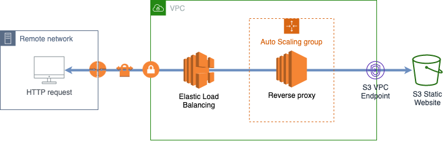

# aws-s3-proxy-farm module

*Note: This repo is no longer maintained and provided as is as a sample*

A [Virtual Private Cloud Endpoint](https://docs.aws.amazon.com/vpc/latest/userguide/vpc-endpoints.html) enables a private connection between a VPC and another AWS service without leaving the Amazon network. VPC endpoints also provide additional security features such as the ability to lock down S3 buckets to specific VPCs.
This feature is available to Amazon EC2 instances running inside of a VPC, however many AWS customers would like to leverage VPC endpoints from remote networks.

This CDK module implements a highly available and scalable solution for providing access to a private [S3 Static Website](https://docs.aws.amazon.com/AmazonS3/latest/dev/WebsiteHosting.html) from remote networks via a VPC endpoint.



See [example/lib/example-stack.ts](example/lib/example-stack.ts) for an example of a minimal deployable pattern definition.

## Initializer

``` text
new S3ProxyFarm(scope: Construct, id: string, props: S3ProxyFarmProps);
```

_Parameters_

* scope [`Construct`](https://docs.aws.amazon.com/cdk/api/latest/docs/@aws-cdk_core.Construct.html)
* id `string`
* props [`S3ProxyFarmProps`](#pattern-construct-props)

## Pattern Construct Props

| **Name**     | **Type**        | **Description** |
|:-------------|:----------------|-----------------|
|vpc|[`Vpc`](https://docs.aws.amazon.com/cdk/api/latest/docs/@aws-cdk_aws-ec2.Vpc.html)|VPC where proxy farm will be deployed.|
|websiteBucket|[`Bucket`](https://docs.aws.amazon.com/cdk/api/latest/docs/@aws-cdk_aws-s3.Bucket.html)|S3 Bucket hosting a static website.|
|autoScalingGroupProps?|[`AutoScalingGroupProps`](https://docs.aws.amazon.com/cdk/api/latest/docs/@aws-cdk_aws-autoscaling.AutoScalingGroupProps.html)|User provided props to override the default props for the proxy farm Auto Scaling Group.|
|cpuUtilizationScalingProps?|[`CpuUtilizationScalingProps`](https://docs.aws.amazon.com/cdk/api/latest/docs/@aws-cdk_aws-autoscaling.CpuUtilizationScalingProps.html)|User provided props to override the default props for the proxy farm CPU Utilization Scaling Policy.|
|allowedCIDRRanges?|`Array<string>`|CIDR range of the peers that can access the reverse proxy (defaults to []).|
|websiteIndexDocument?|`string`|Name of the index file for the static website (defaults to index.html).|

## Helper methods

You can use the following helper method to expose the proxy farm using a Network Load Balancer:

``` text
createNetworkLoadBalancerListener(lb: NetworkLoadBalancer, listenerProps: BaseNetworkListenerProps, allowedCIDRRange: string)
```

_Parameters_

* lb [`NetworkLoadBalancer`](https://docs.aws.amazon.com/cdk/api/latest/docs/@aws-cdk_aws-elasticloadbalancingv2.NetworkLoadBalancer.html)
* listenerProps [`BaseNetworkListenerProps`](https://docs.aws.amazon.com/cdk/api/latest/docs/@aws-cdk_aws-elasticloadbalancingv2.BaseNetworkListenerProps.html)
* allowedCIDRRange `string`: Only allow access to the proxy farm to peers in the given CIDR range (defaults to 0.0.0.0/0)
